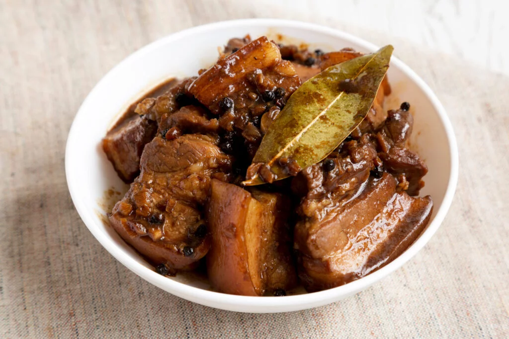
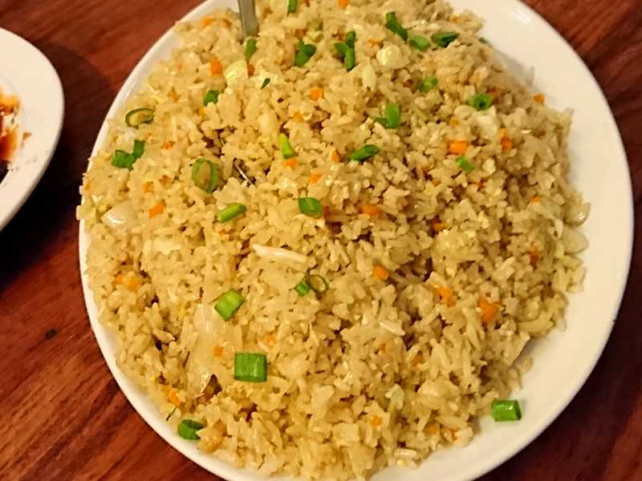
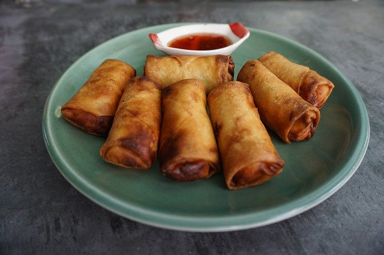

- レチョン 

- シシグ 

- アドボ 

- ガーリックライス 

- シニガン 

- ルンピア 

- パンシット 

| 料理名 | 画像 |
|--------|------|
| レチョン |  |
| シシグ |  |
| アドボ |  |
| ガーリックライス |  |
| シニガン |  |
| ルンピア |  |
| パンシット |  |

### 参考
- [【2025】セブ島の食べ物ガイド｜おすすめ定番グルメ・レストラン・注意点まとめ](https://www.kkday.com/ja/blog/143127/asia-philippines-cebu-food)
