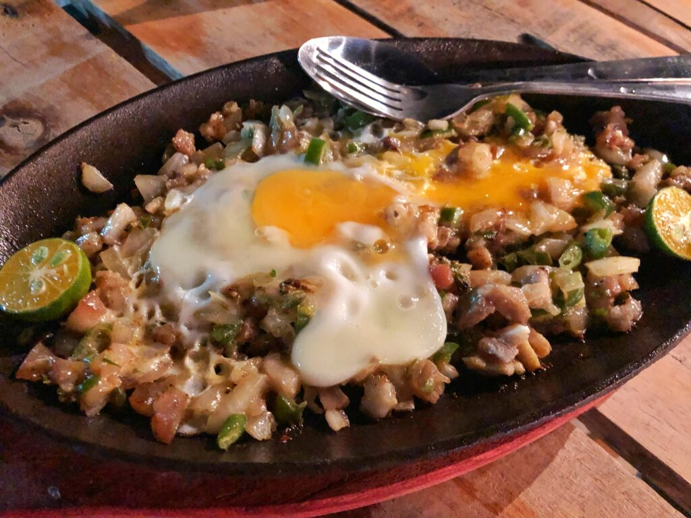
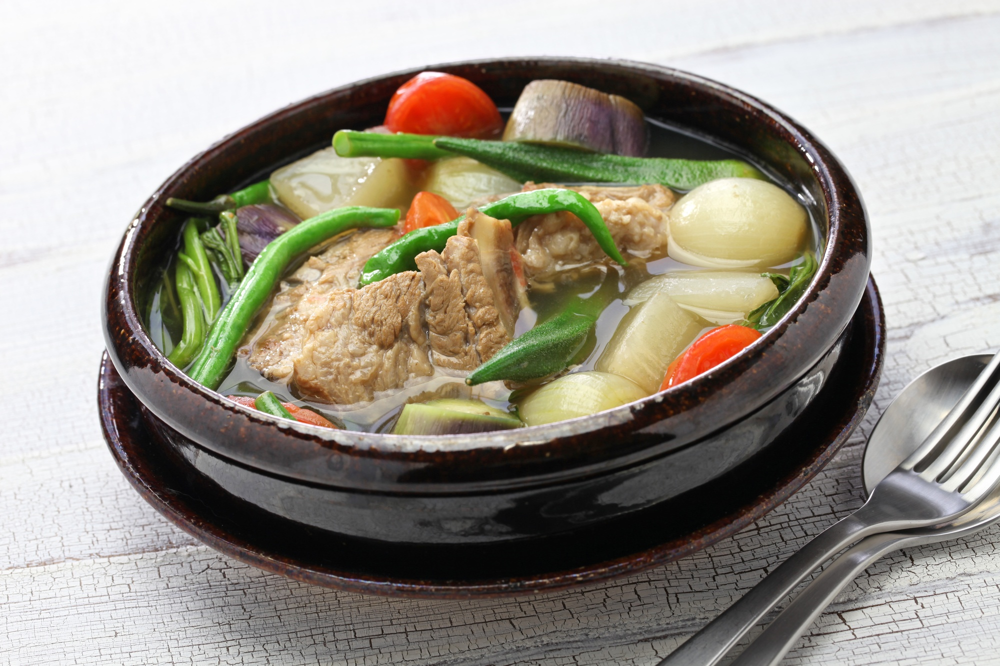
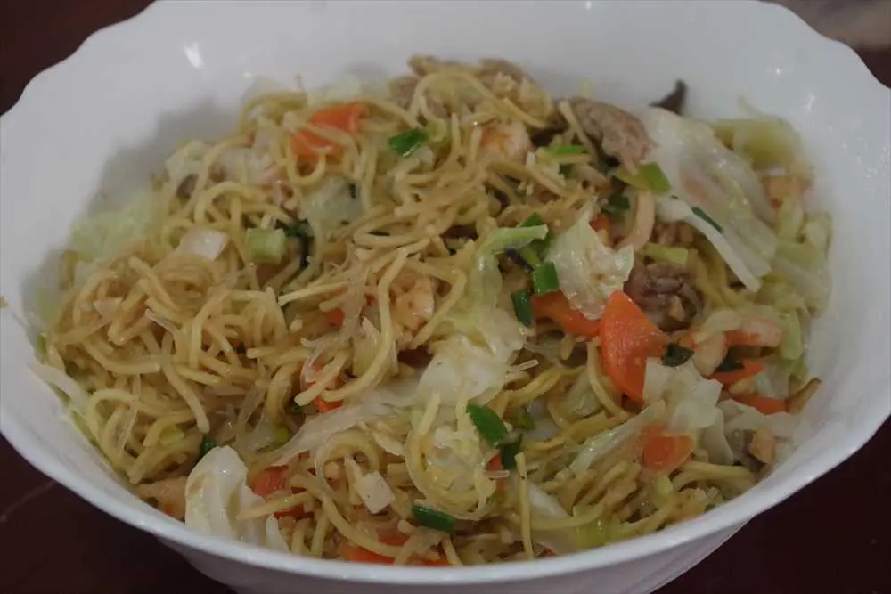
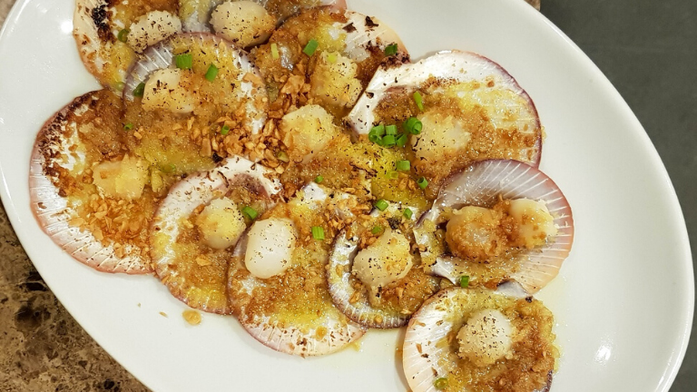
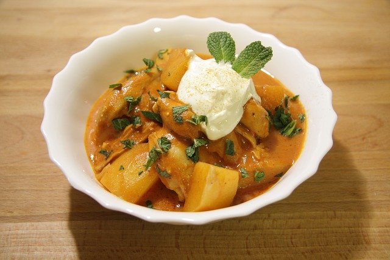
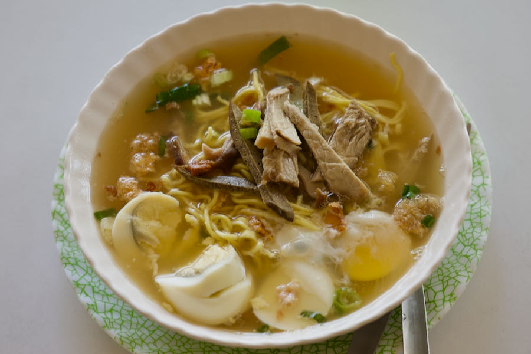
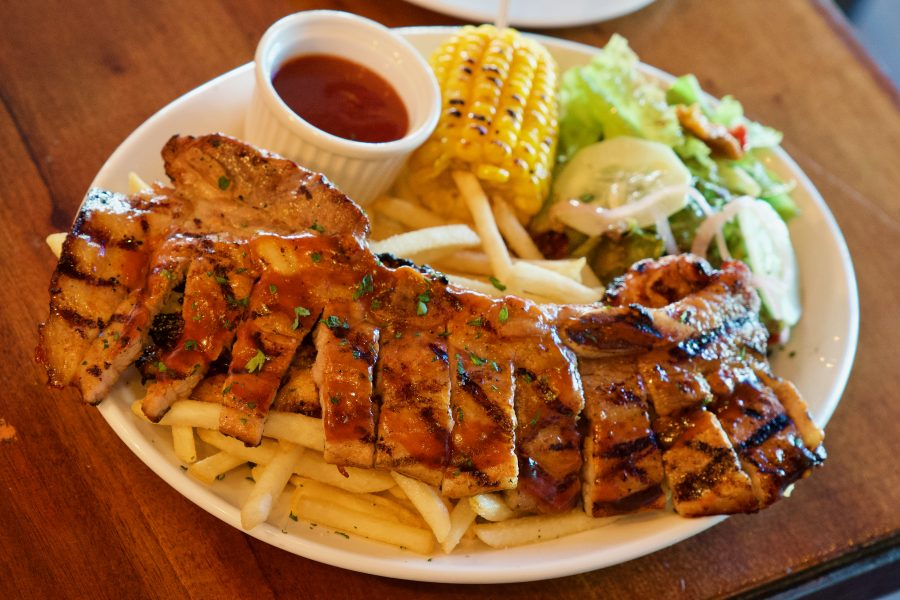
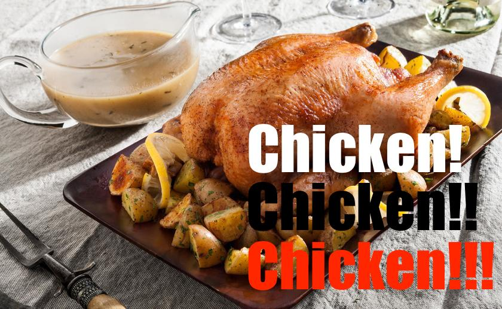
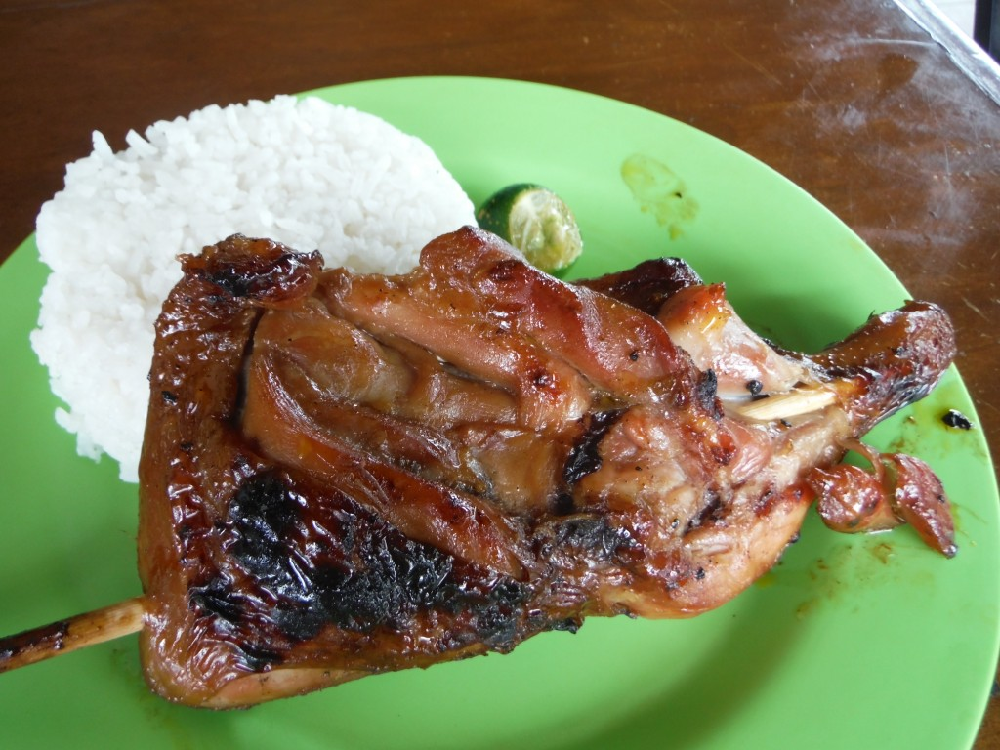
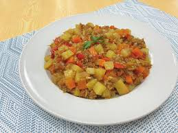

| 料理名 | 画像 |
|--------|------|
| レチョン |  |
| シシグ |  |
| アドボ |  |
| ガーリックライス |  |
| シニガン |  |
| ルンピア |  |
| パンシット |  |
| ベイクド・スカラップ |  |
| カレカレ |  |
| バッチョイ |  |
| ポークベリー |  |
| レチョンマノック |  |
| チキン・イナサル |  |
| ギニリン |  |

### 参考
- [【2025】セブ島の食べ物ガイド｜おすすめ定番グルメ・レストラン・注意点まとめ](https://www.kkday.com/ja/blog/143127/asia-philippines-cebu-food)
- [【完全保存版】セブ島グルメ・食べ物13選｜初めてでも失敗しないおすすめレストラン＆料理を紹介](https://csp-cebu.com/navi/cebu-food/)
- [セブ島の食べ物って？人気グルメ10選＆美味しいごはん、デザートも紹介](https://magazine.cebutour.co/cebu_food/)
- [【厳選フィリピン料理】セブ島で絶対食べたい！定番メニュー＆おすすめレストラン8選](https://www.cebupot.com/columns/restaurant/philippinecuisinerestaurant/)
- [【厳選フィリピン料理】セブ島で絶対食べたい！定番メニュー＆おすすめレストラン8選](https://cebu-oh.com/matome/archives/2741)
