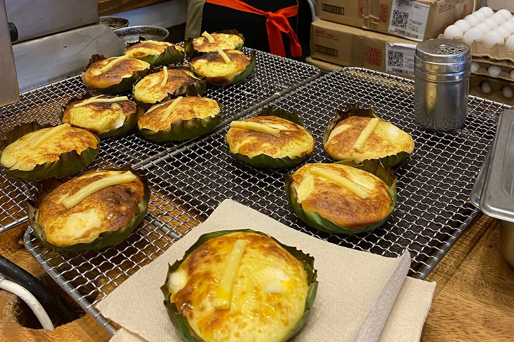
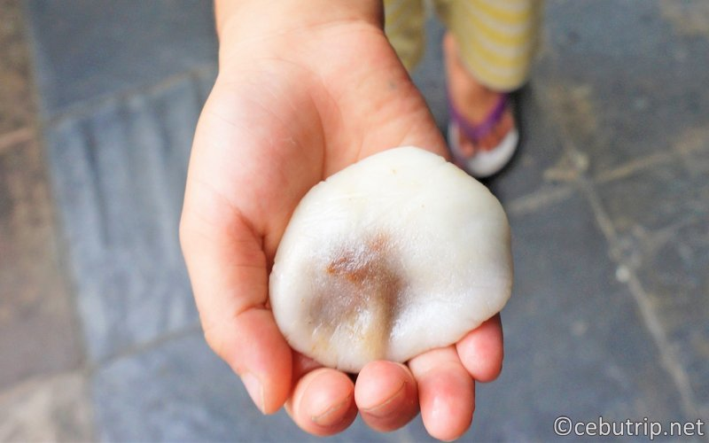
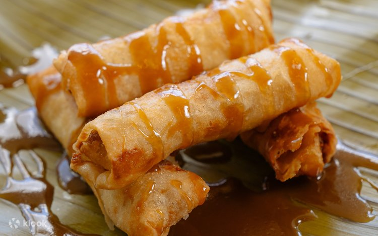
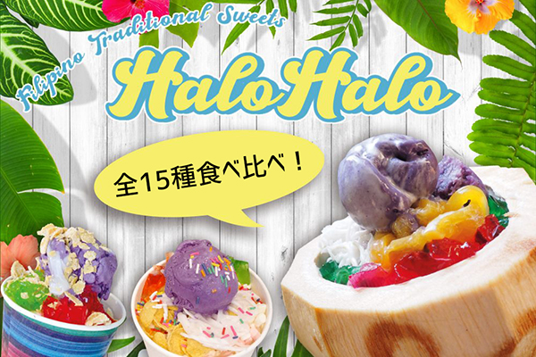
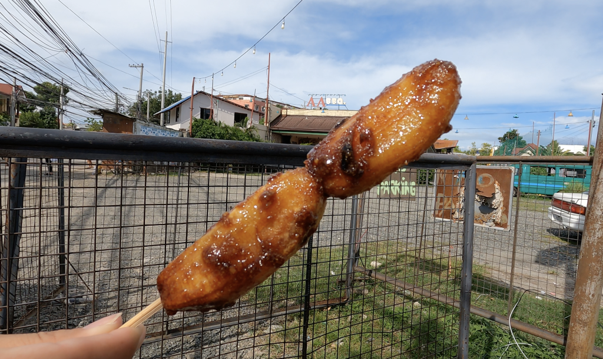
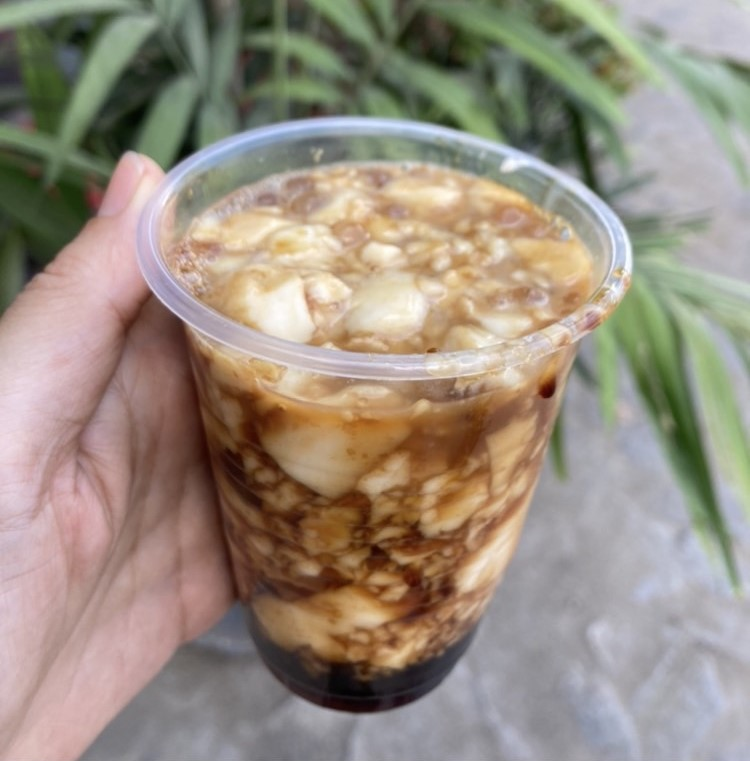
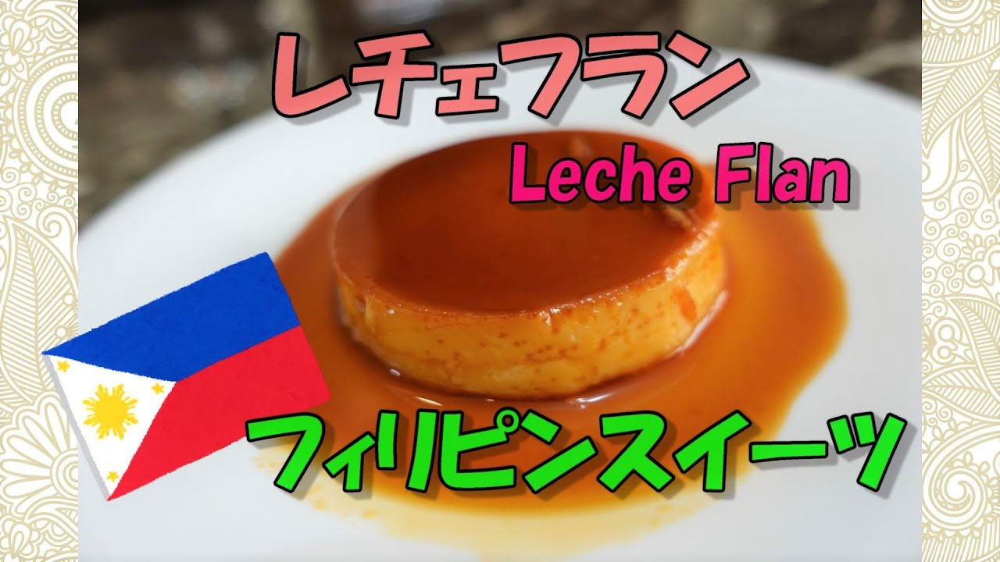

| 料理名 | 画像 |
|--------|------|
| ビビンカ |  |
| マシ |  |
| トゥロン |  |
| ハロハロ |  |
| バナナ・キュー |  |
| タホ |  |
| レチェフラン |  |

### 参考
- [【完全保存版】セブ島グルメ・食べ物13選｜初めてでも失敗しないおすすめレストラン＆料理を紹介](https://csp-cebu.com/navi/cebu-food/)
