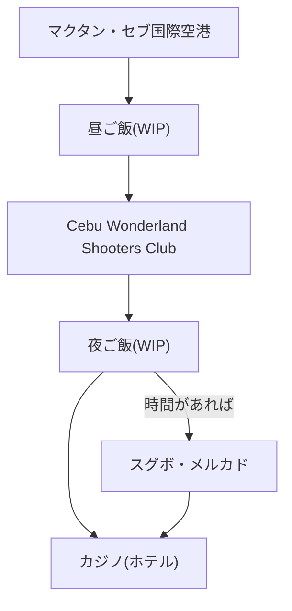

### 1日目(午後半日)
#### 案1 (日中はマクタン島)
- 昼過ぎ
  - マクタン・セブ国際空港 @マクタン島
- 昼ご飯
  - WIP
- 午後
  - [Cebu Wonderland Shooters Club](https://www.cebu-tours.com/gun) @マクタン島
- 夜
  - [スグボ・メルカド](https://www.ceburyugaku-master.com/activity/sugbo.html) @セブシティ
  - カジノ(ホテル) @セブシティ
- 夜ご飯
  - WIP

#### 案2 (歴史に触れよう)
- 昼過ぎ
  - マクタン・セブ国際空港 @マクタン島
- 昼ご飯
  - WIP
- 午後
  - [サント・ニーニョ教会](https://philippinetravel.jp/sto-nino-church/) @セブシティ
  - [マゼランクロス](https://philippinetravel.jp/magellans-cross/) @セブシティ
  - [サン・ペドロ要塞](https://philippinetravel.jp/fort-san-pedro/) @セブシティ
- 夜
  - [スグボ・メルカド](https://www.ceburyugaku-master.com/activity/sugbo.html) @セブシティ
  - カジノ(ホテル) @セブシティ
- 夜ご飯
  - WIP

### 2日目(全日)
- [オスロブ(ジンベエザメ)](https://philippinetravel.jp/areainfo/oslob/) @セブ島南東
- [モアルボアル(イワシ)](https://philippinetravel.jp/areainfo/oslob/) @セブ島南西
- [カワサン滝](https://philippinetravel.jp/kawasan-falls/) @セブ島南西

### 3日目(全日)
- [SMシーサイドセブ](https://csp-cebu.com/navi/souvenirs/) @セブシティ

### 4日目(ほぼ無し)
- 移動のみ
