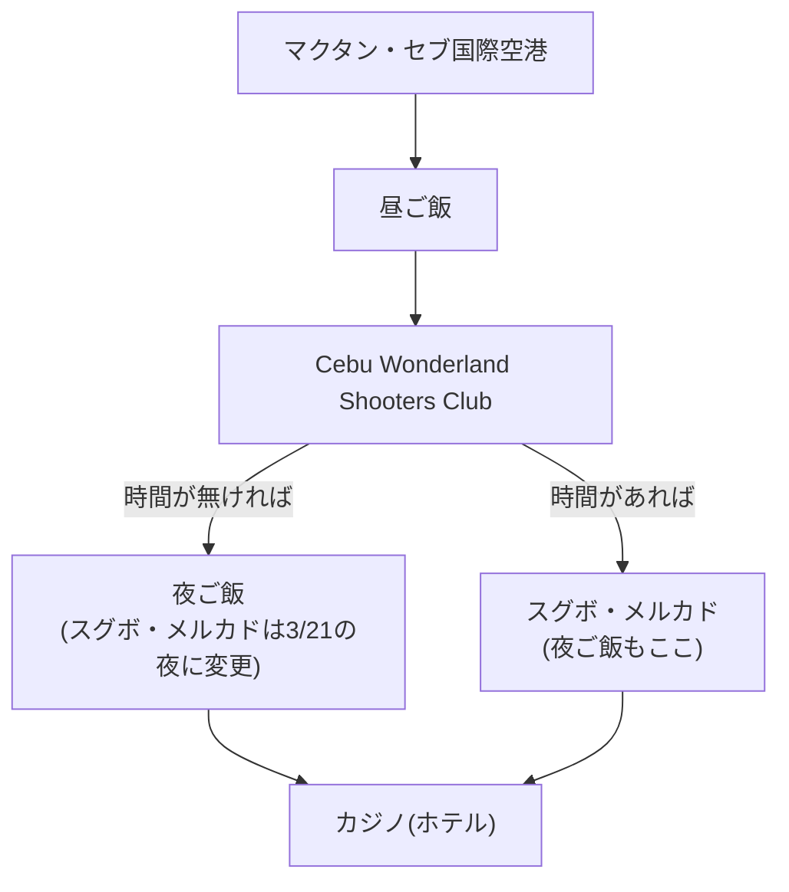

## 日程
- 昼過ぎ
  - マクタン・セブ国際空港 @マクタン島
- 昼ご飯
  - 当日決める
- 午後
  - [Cebu Wonderland Shooters Club](https://www.cebu-tours.com/gun) @マクタン島
- 夜ご飯
  - ナイトマーケット or 当日決める
- 夜
  - [スグボ・メルカド](https://www.ceburyugaku-master.com/activity/sugbo.html) @セブシティ
  - カジノ(ホテル) @セブシティ

## フローチャート

