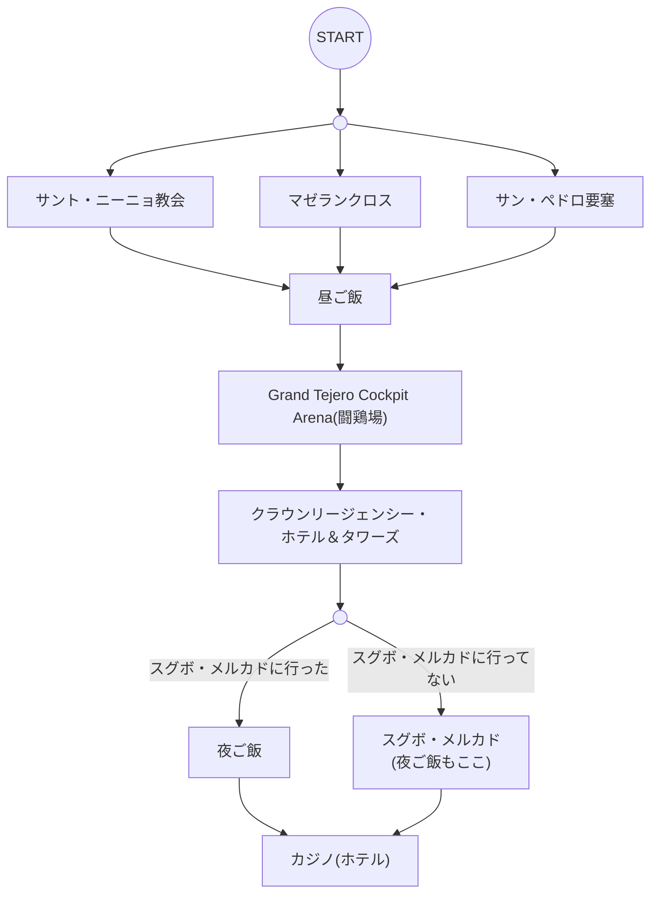

## 日程
- 午前
  - [サント・ニーニョ教会](https://philippinetravel.jp/sto-nino-church/) @セブシティ (**6時から？**)
  - [マゼランクロス](https://philippinetravel.jp/magellans-cross/) @セブシティ (**8時から？**)
  - [サン・ペドロ要塞](https://philippinetravel.jp/fort-san-pedro/) @セブシティ (**8時から？**)
- 昼ご飯
  - 当日決める
- 午後
  -  [Grand Tejero Cockpit Arena](https://cebruit.com/2020/04/30/%E3%83%95%E3%82%A3%E3%83%AA%E3%83%94%E3%83%B3%E3%81%AE%E3%83%AD%E3%83%BC%E3%82%AB%E3%83%AB%E3%82%AE%E3%83%A3%E3%83%B3%E3%83%96%E3%83%AB-%E9%97%98%E9%B6%8F%E5%A0%B4-%E7%94%9F%E6%B4%BB%E8%B2%BB/#Grand_Tejero_Cockpit_Arena) @セブシティ (**17時まで？**) (※ もっと良い場所があるかも)
  - [クラウンリージェンシー・ホテル＆タワーズ](https://csp-cebu.com/navi/crownregency/) @セブシティ
- 夜ご飯
  - 当日決める or ナイトマーケット
- 夜
  - ([スグボ・メルカド](https://www.ceburyugaku-master.com/activity/sugbo.html) @セブシティ)
  - カジノ(ホテル) @セブシティ

## フローチャート

